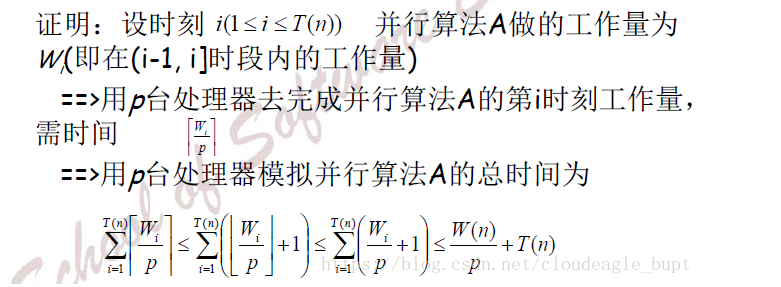

- ((63e3642a-14b8-41d2-9e1f-cc947425771e))
- 令W(n)是某并行算法A在运行时间T(n)内所执行的运算量，则A使用p台处理器可在t(n)=O(W(n)/p+T(n))时间内执行完毕。
- W(n)和c(n)密切相关，c(n)=t(n)*p=O(W(n)+p*T(n))
- p=O(W(n)/T(n))时，W(n)和c(n)两者是渐进一致的
- 对于任意的p，c(n)›W(n)。这说明一个算法在运行过程中，不一定都能充分的利用有效的处理器去工作。
- 证明：
- 